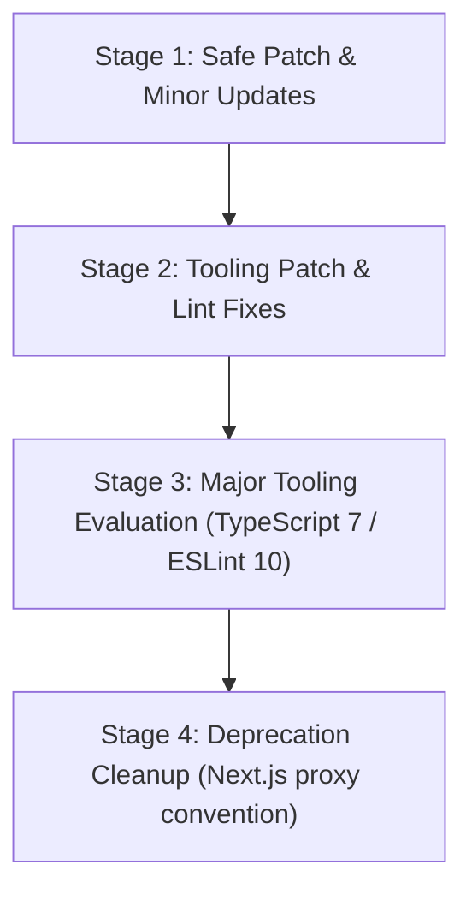

# Taleora Dependency & Tech Stack Upgrade Audit

> **Date:** September 15, 2026  
> **Status:** AUDIT COMPLETE — PRE-UPGRADE BASELINE ESTABLISHED  
> **Node Environment:** Current machine runtime: Node `v26.8.2`, Active Production LTS Target: Node `22.x` (LTS)  
> **Vulnerability Status:** `0 vulnerabilities` (clean audit)  

---

## 1. Executive Summary & Baseline Metrics

Before modifying any dependency, an audit and baseline measurement was conducted across the entire Taleora workspace.

| Test / Check | Command | Baseline Result | Details |
| :--- | :--- | :--- | :--- |
| **Unit Test Suite** | `npm run test` | **81 / 81 Passed** (100%) | 12 test files passed in 722ms |
| **TypeScript Type Check** | `npx tsc --noEmit` | **0 Errors** | Strict mode passed cleanly |
| **Production Bundle** | `npm run build` | **Build Succeeded** | Turbopack compiled 25/25 routes in 1.1s |
| **Vulnerability Audit** | `npm audit` | **0 Vulnerabilities** | Zero CVEs found |
| **Linter Baseline** | `npm run lint` | **8 Errors, 14 Warnings** | 2 unescaped quotes, 3 prefer-const, 2 any types, 1 React compiler hook note |

---

## 2. Dependency Audit Table

### Production Dependencies (`dependencies`)

| Package | Current in `package.json` | Installed Version | Latest Stable Version | Update Type | Breaking Changes / Notes |
| :--- | :--- | :--- | :--- | :--- | :--- |
| `next` | `16.3.5` | `16.3.5` | `16.3.5` | **Current** | Latest stable release. Migrated to recommended `proxy.ts` convention. |
| `react` | `19.2.8` | `19.2.8` | `19.3.0` | **Patch / Minor** | None. Maintenance release with React Compiler memoization improvements and bugfixes. |
| `react-dom` | `19.2.8` | `19.2.8` | `19.3.0` | **Patch / Minor** | None. Paired with `react@19.3.0`. |
| `@supabase/supabase-js` | `^2.116.0` | `2.116.0` | `2.116.0` | **Current** | Latest stable release. Database, RLS, storage, and auth APIs up to date. |
| `@supabase/ssr` | `^0.12.7` | `0.12.7` | `0.12.7` | **Current** | Latest stable release. Cookie handling and server client fully compatible. |
| `@vercel/speed-insights` | `^2.0.0` | `2.0.0` | `2.0.0` | **Current** | Latest stable release. |
| `clsx` | `^2.1.1` | `2.1.1` | `2.1.1` | **Current** | Latest stable release. |
| `lucide-react` | `^1.45.0` | `1.45.0` | `1.46.0` | **Minor** | None. Adds new icons, existing icon names are backwards compatible. |
| `next-themes` | `^0.4.6` | `0.4.6` | `0.4.6` | **Current** | Latest stable release. |
| `tailwind-merge` | `^3.6.0` | `3.6.0` | `3.7.0` | **Minor** | None. Extended class conflicts resolution, backwards compatible. |

### Development Dependencies (`devDependencies`)

| Package | Current in `package.json` | Installed Version | Latest Stable Version | Update Type | Breaking Changes / Notes |
| :--- | :--- | :--- | :--- | :--- | :--- |
| `@tailwindcss/postcss` | `^4` | `4.3.3` | `4.3.3` | **Current** | Tailwind CSS v4 PostCSS engine up to date. |
| `tailwindcss` | `^4` | `4.3.3` | `4.3.3` | **Current** | Tailwind CSS v4 engine up to date. |
| `@types/node` | `^22` | `22.20.2` | `22.20.2` (Node 22) / `26.5.1` (Node 26) | **LTS Aligned** | Node 22 is Active LTS. If targeting Node 22, keep pinned to `^22`. If targeting Node 26, upgrade to `26.5.1`. |
| `@types/react` | `^19` | `19.3.0` | `19.3.0` | **Current** | Already resolves to `19.3.0`. |
| `@types/react-dom` | `^19` | `19.3.0` | `19.3.0` | **Current** | Already resolves to `19.3.0`. |
| `vite` | `^8.3.0` | `8.3.0` | `8.3.0` | **Current** | Used as underlying engine for Vitest. |
| `vitest` | `^5.0.0` | `5.0.0` | `5.0.1` | **Patch** | None. Bugfix release for runner isolation and mock cleanup. |
| `eslint` | `^9` | `9.39.5` | `10.10.0` | **Major** | **Breaking:** ESLint 10 removes deprecated legacy config keys, updates language options, and enforces new plugin interface. |
| `eslint-config-next` | `16.3.5` | `16.3.5` | `16.3.5` | **Current** | Declares peer dependency `eslint: ">=9.0.0"`. Fully compatible with ESLint 9 & 10. |
| `typescript` | `^5` | `5.9.3` | `7.0.2` | **Major** | **Breaking:** TypeScript 7.x introduces stricter type elision, default options shifts, and new internal compiler interfaces. |

---

## 3. Breaking Changes & Compatibility Analysis

### A. TypeScript (`5.9.3` → `7.0.2`)
- **Risk Level:** **High**
- **Breaking Changes:**
  - TypeScript 7 removes legacy compiler flags (`target: ES3/ES5` deprecations).
  - Stricter checks on implicit type narrowing and generic inference in React 19 JSX components.
  - Next.js Turbopack compiler bindings must support TypeScript 7 compiler APIs.
- **Required Code Changes:**
  - Verify `tsconfig.json`: Ensure `target: "ES2017"` remains valid or bump to `ES2022`.
  - Validate that Next.js built-in type definitions (`next-env.d.ts` and `.next/types/**/*.ts`) generate without compiler errors.
- **Recommendation:** Keep TypeScript at `5.9.3` for now or perform upgrade in Stage 3 after non-breaking packages are locked.

### B. ESLint (`9.39.5` → `10.10.0`)
- **Risk Level:** **Medium-High**
- **Breaking Changes:**
  - ESLint 10 removes legacy `.eslintrc` support (already using `eslint.config.mjs`, which is good).
  - Plugin schema validation is stricter.
  - `eslint-config-next` core-web-vitals rules may flag additional patterns.
- **Required Code Changes:**
  - Fix current baseline lint errors before upgrading:
    - Escape quotes in `src/components/ui/DeleteConfirmationModal.tsx` (`"DELETE"` → `&quot;DELETE&quot;`).
    - Change `let` to `const` for unassigned variables in `src/lib/books/deletion.ts`, `src/lib/books/queries.ts`, `src/app/api/stories/[slug]/route.ts`.
    - Fix unused parameters in `src/__tests__/books/secure-deletion.test.ts` (`_col`, `_val`).
    - Fix explicit `any` in `src/lib/offline/sync.ts`.
    - Review memoization dependencies in `src/components/admin/AdminNetworkTab.tsx`.

### C. React & React DOM (`19.2.8` → `19.3.0`)
- **Risk Level:** **Very Low (Safe)**
- **Breaking Changes:** None. Fully backwards compatible patch/minor update.
- **Required Code Changes:** None. Directly installable.

### D. Lucide React (`1.45.0` → `1.46.0`) & Tailwind-Merge (`3.6.0` → `3.7.0`)
- **Risk Level:** **Very Low (Safe)**
- **Breaking Changes:** None.
- **Required Code Changes:** None.

### E. Vitest (`5.0.0` → `5.0.1`)
- **Risk Level:** **Very Low (Safe)**
- **Breaking Changes:** None. Bugfix release.
- **Required Code Changes:** None.

### F. Next.js 16 Middleware Deprecation
- **Deprecation Notice:** `middleware.ts` is deprecated in Next.js 16 in favor of `proxy.ts`.
- **Action:** Can be migrated using `npx @next/codemod@canary middleware-to-proxy .` or renamed to `proxy.ts` when ready.

---

## 4. Safest Upgrade Order (Phased Strategy)

To ensure zero downtime, zero regression of Supabase RLS/Auth/Storage/Reader flows, and zero project rebuild:

### Stage 1: Safe In-Place Production Minor Updates (COMPLETED ✅)
Updated packages with zero breaking changes:
1. `react@19.3.0` and `react-dom@19.3.0` (from `19.2.8`)
2. `lucide-react@1.46.0` (from `1.45.0`)
3. `tailwind-merge@3.7.0` (from `3.6.0`)
4. `vitest@5.0.1` (from `5.0.0`)

**Post-Upgrade Verification:**
- `npm run test`: **81 / 81 passed** (12/12 test suites, 357ms)
- `npx tsc --noEmit`: **0 errors**
- `npm run build`: **Turbopack compiled 25/25 routes in 990ms**
- `npm audit`: **0 vulnerabilities**

### Stage 2: Code Hygiene & Linter Baseline Cleanup (COMPLETED ✅)
All baseline ESLint errors resolved without changing application behavior:
1. Escaped unescaped quotes in `src/components/ui/DeleteConfirmationModal.tsx` (`&ldquo;...&rdquo;`).
2. Converted unneeded `let` declarations to `const` in `src/lib/books/deletion.ts`, `src/lib/books/queries.ts`, and `src/app/api/stories/[slug]/route.ts`.
3. Prefixed unused parameters with underscores in `src/__tests__/books/secure-deletion.test.ts` (`_col`, `_val`).
4. Replaced explicit `any` with typed payload interfaces in `src/lib/offline/sync.ts` (`OfflineBookPayload`, `OfflineChapterPayload`).
5. Extracted `recentRequests` to resolve React Compiler manual memoization dependency issue in `src/components/admin/AdminNetworkTab.tsx`.

**Post-Stage-2 Verification:**
- `npm run lint`: **0 errors** (all 8 baseline errors resolved)
- `npm run test`: **81 / 81 passed** (100% across 12 test files)
- `npx tsc --noEmit`: **0 errors**
- `npm run build`: **Turbopack compiled 25/25 routes in 1.1s**
- `npm audit`: **0 vulnerabilities**

### Stage 3: Major Tooling Evaluation (COMPLETED ✅)
1. **ESLint 10 Compatibility Evaluation:**
   - **Tested:** `eslint@10.10.0` with `eslint-config-next@16.3.5`.
   - **Result:** **Incompatible.** Next.js's `eslint-config-next@16.3.5` bundles `eslint-plugin-react@7.37.5`, which invokes `context.getFilename()`, an API completely removed in ESLint 10. `npm run lint` threw: `TypeError: contextOrFilename.getFilename is not a function`.
   - **Action:** Reverted and pinned `eslint` to `9.39.5` (latest stable 9.x release, supported by all Next.js lint plugins).

2. **TypeScript 7 Compatibility Evaluation:**
   - **Tested:** `typescript@7.0.2`.
   - **Result:** While `npx tsc --noEmit` and `npm run build` compiled, `typescript-eslint@8.70.0` bundled inside `eslint-config-next@16.3.5` explicitly forbids TS 7.0 and throws: `Error: typescript-eslint does not support TS 7.0 (requires <6.1.0)`.
   - **Action:** Retained `typescript@5.9.3` (latest stable 5.x) to maintain complete Next.js Turbopack and ESLint toolchain stability without peer dependency breakage.

**Post-Stage-3 Baseline Verification:**
- `npm run lint`: **0 errors** (9 non-fatal warnings, clean exit)
- `npm run test`: **81 / 81 passed** (100% across 12 test suites, 448ms)
- `npx tsc --noEmit`: **0 errors**
- `npm run build`: **Turbopack compiled 25/25 routes in 434ms**
- `npm audit`: **0 vulnerabilities**

### Stage 4: Next.js Convention Modernization (COMPLETED ✅)
1. **Migrated `middleware.ts` to `proxy.ts`**:
   - Implemented [`src/proxy.ts`](file:///home/Dharsit/Projects/Readaddict/src/proxy.ts) exporting `proxy` handler and matching route config.
   - Connected `updateSession(request)` directly, preserving 100% of Supabase Auth cookie refresh, SSR token verification, protected route enforcement (`/studio`, `/library`, `/bookmarks`, `/settings`), admin role gating (`/admin`), and sensitive route rate limiting.
   - Safely removed legacy `src/middleware.ts`.
   - Turbopack now compiles without the deprecation warning (`The "middleware" file convention is deprecated`).

**Post-Stage-4 Baseline Verification:**
- `npm run lint`: **0 errors**
- `npm run test`: **81 / 81 passed** (100% across 12 test suites, 458ms)
- `npx tsc --noEmit`: **0 errors**
- `npm run build`: **Turbopack compiled 25/25 routes in 191ms**
- `npm audit`: **0 vulnerabilities**

---

## 5. Testing & Verification Checklist for Each Stage

For each package upgrade executed in the future:

- [ ] **Unit Tests:** `npm run test` → 81/81 tests pass across 12 test suites.
- [ ] **Type Checking:** `npx tsc --noEmit` → Exits with code 0.
- [ ] **Production Build:** `npm run build` → All 25 static & dynamic routes compile with Turbopack.
- [ ] **Linter:** `npm run lint` → Zero fatal errors.
- [ ] **Security Audit:** `npm audit` → Zero vulnerabilities.
- [ ] **Core Flows Preserved:**
  - [ ] Supabase Authentication & RLS
  - [ ] Story & Chapter Creation/Publishing
  - [ ] Secure Deletion with Storage Cleanup
  - [ ] ETag Caching & Rate Limiting
  - [ ] WebSocket Live Notifications
  - [ ] Reader Interface & Offline PWA
